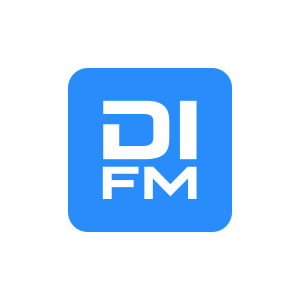
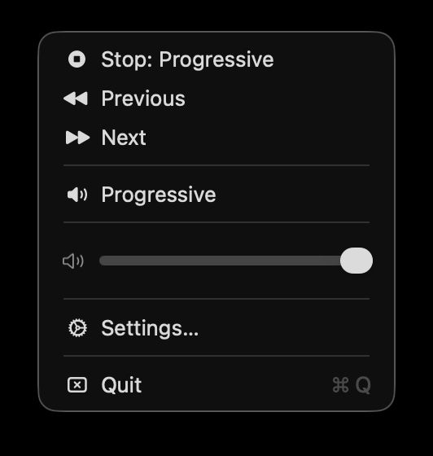
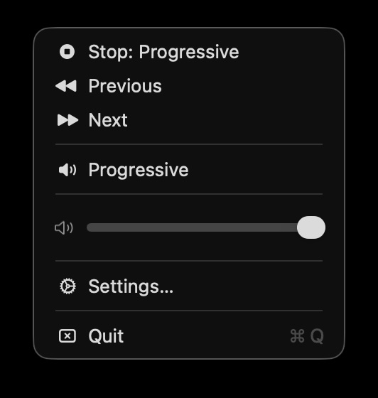
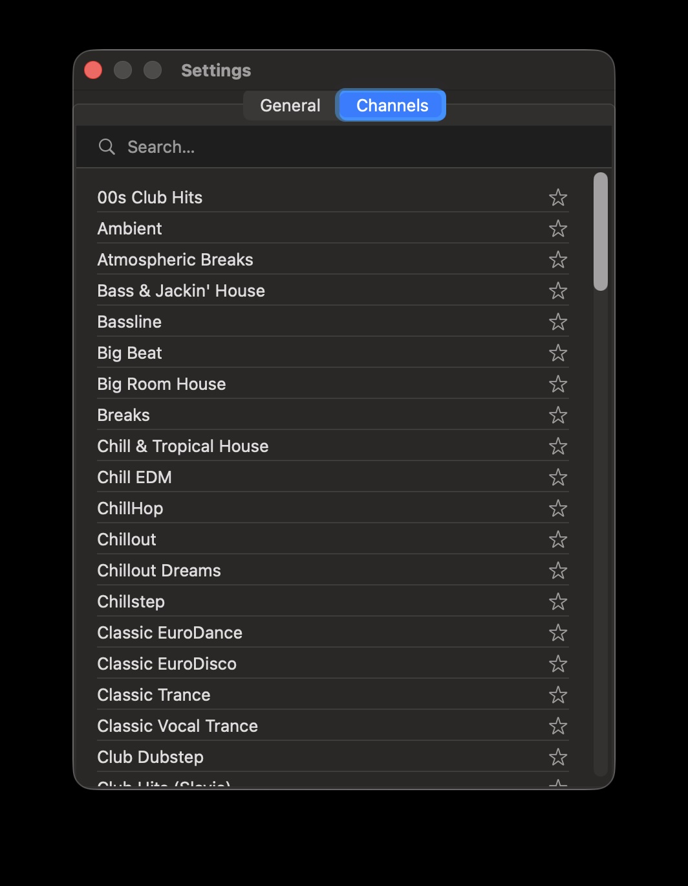

<p align="center">
  
</p>

# DI.FM Player

> **Unofficial personal project — not affiliated with or endorsed by DI.FM / Digitally Imported.**

Native macOS menu bar app for [DI.FM](https://www.di.fm) premium streaming.


---

## Screenshots

| Right-click menu | Settings — General | Settings — Channels |
|:---:|:---:|:---:|
|  |  |  |

---

## What it does

DI.FM Player sits as a small icon in your menu bar. Click it to start or pause a stream — no Dock icon, no separate window getting in the way.

- **Left-click** the icon → start/pause the current stream
- **Right-click** the icon → menu with favorites, previous/next, volume and settings
- Automatically restarts the last channel on app launch
- Media keys on keyboard and headphones work (via `MPRemoteCommandCenter`)
- Favorites are stored locally

## Requirements

- macOS 13 Ventura or later
- A [DI.FM Premium](https://www.di.fm/premium) subscription
- Your **Listen Key** (found at di.fm → Settings → Hardware Player)

---

## Download & First Launch

> ⚠️ **The app is not notarized by Apple.**
>
> Notarization requires a paid Apple Developer account. This is a personal open-source project,
> so the app is distributed unsigned. macOS Gatekeeper will block the app from opening the first
> time. **This is expected and does not mean the app contains malware.**

### Steps after downloading:

1. Download `DI.FM.Player.zip` from [Releases](../../releases)
2. Double-click the zip to unzip it
3. Move `DI.FM Player.app` to your `/Applications` folder
4. **Do not double-click yet** — Gatekeeper will show _"cannot be opened because it is from an unidentified developer"_

**Option A — easiest (no Terminal needed):**

Right-click `DI.FM Player.app` in Finder → **Open** → click **Open** in the dialog.
You only need to do this once.

**Option B — Terminal:**
```bash
xattr -cr "/Applications/DI.FM Player.app"
```
Then double-click the app normally.

5. On first launch: right-click the menu bar icon → **Settings…** → enter your Listen Key and save
6. Go to the **Channels** tab to mark your favorites with ★

---

## Build from source

1. Clone or download the repository
2. Open `DI.FM Player.xcodeproj` in Xcode
3. Build and run with `⌘R`
4. Right-click the menu bar icon → **Settings…** → enter your Listen Key and save

---

## Architecture

| File | Responsibility |
|---|---|
| `DI_FM_PlayerApp.swift` | App entry point, SwiftUI `Settings` scene |
| `Services/StatusBarController.swift` | `NSStatusItem` — click behavior, menu building, icon updates |
| `Services/AudioPlayer.swift` | AVPlayer wrapper, media keys |
| `Services/DIFMService.swift` | API calls, PLS parsing |
| `Services/SettingsManager.swift` | Listen key + favorites in UserDefaults |
| `Models/Channel.swift` | Codable channel model |
| `Models/ChannelStore.swift` | Fetch channels, auto-play on start |
| `Views/ChannelPickerView.swift` | Search and manage favorites |
| `Views/SettingsView.swift` | Enter listen key |

## DI.FM API

- Channels: `GET https://listen.di.fm/premium_high.json`
- Stream: `{channel.playlist}?listen_key={key}` → PLS file → `File1=` URL → AVPlayer

## Releases

Releases are built automatically via GitHub Actions when a version tag is pushed:

```bash
git tag v1.0.0
git push origin v1.0.0
```

---

## Disclaimer

This project is not affiliated with, endorsed by, or in any way officially connected to DI.FM (Digitally Imported). DI.FM and related marks are trademarks of their respective owners. This is an independent open-source project built for personal use.
