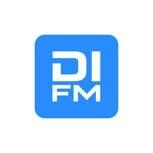
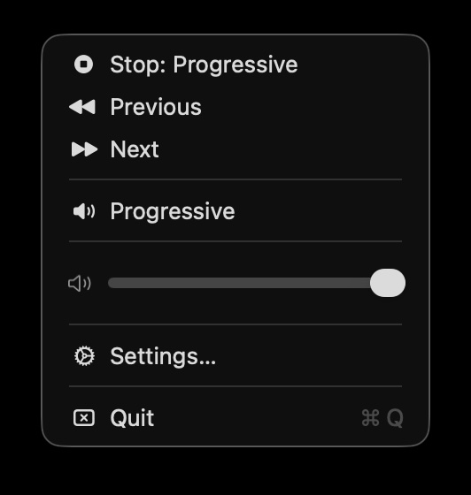
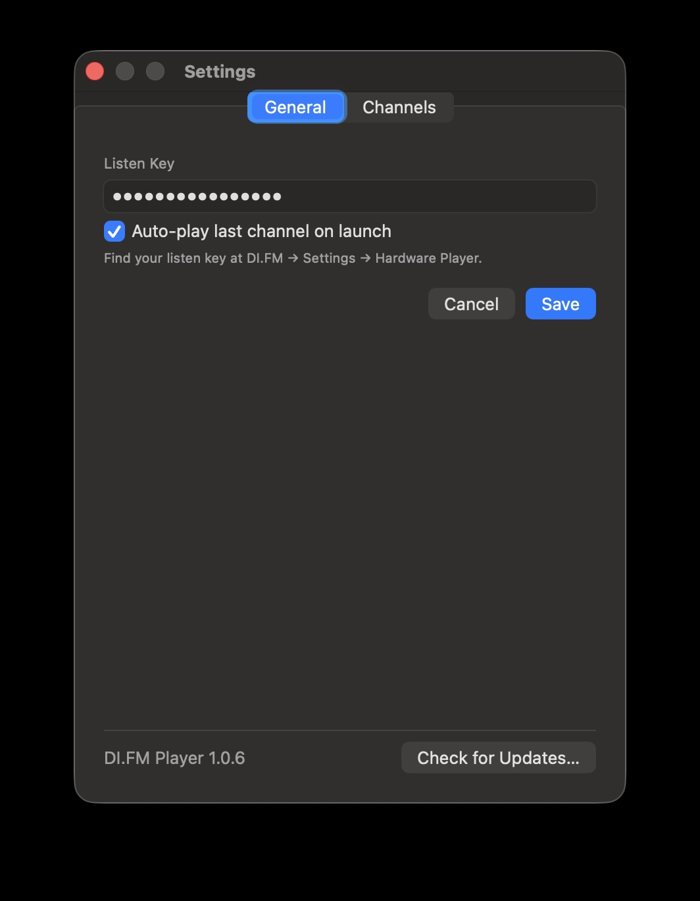
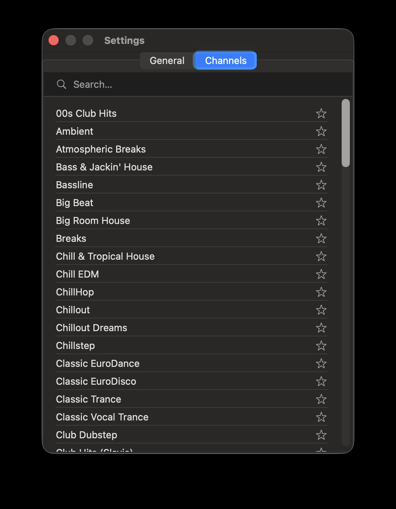

<p align="center">
  
</p>

# DI.FM Player

> **Unofficial personal project — not affiliated with or endorsed by DI.FM / Digitally Imported.**

Native macOS menu bar app for [DI.FM](https://www.di.fm) premium streaming.


---

## Screenshots

| Right-click menu | Settings — General | Settings — Channels |
|:---:|:---:|:---:|
|  |  |  |

---

## What it does

DI.FM Player sits as a small icon in your menu bar. Click it to start or pause a stream — no Dock icon, no separate window getting in the way.

- **Left-click** the icon → start/pause the current stream
- **Right-click** the icon → menu with favorites, previous/next, volume and settings
- Automatically restarts the last channel on app launch
- Automatically reconnects when the stream drops (network hiccup, server disconnect, wake from sleep)
- Media keys on keyboard and headphones work (via `MPRemoteCommandCenter`)
- Favorites are stored locally

## Requirements

- macOS 13 Ventura or later
- A [DI.FM Premium](https://www.di.fm/premium) subscription
- Your **Listen Key** (found at di.fm → Settings → Hardware Player)

---

## Download

1. Download `DI.FM.Player.zip` from [Releases](../../releases/latest)
2. Unzip it and move `DI.FM Player.app` to your `/Applications` folder
3. Open the app — it's signed with a Developer ID and notarized by Apple, so it opens without Gatekeeper warnings
4. Right-click the menu bar icon → **Settings…** → enter your Listen Key and save
5. Go to the **Channels** tab to mark your favorites with ★

Updates are delivered automatically via [Sparkle](https://sparkle-project.org).

> Versions up to 1.0.6 were unsigned. If you still run one of those, the next
> automatic update brings you to a signed build — no action needed.

---

## Build from source

1. Clone or download the repository
2. Open `DI.FM Player.xcodeproj` in Xcode
3. Build and run with `⌘R`
4. Right-click the menu bar icon → **Settings…** → enter your Listen Key and save

---

## Architecture

| File | Responsibility |
|---|---|
| `DI_FM_PlayerApp.swift` | App entry point, SwiftUI `Settings` scene |
| `Services/StatusBarController.swift` | `NSStatusItem` — click behavior, menu building, icon updates |
| `Services/AudioPlayer.swift` | AVPlayer wrapper, media keys |
| `Services/DIFMService.swift` | API calls, PLS parsing |
| `Services/SettingsManager.swift` | Listen key + favorites in UserDefaults |
| `Models/Channel.swift` | Codable channel model |
| `Models/ChannelStore.swift` | Fetch channels, auto-play on start |
| `Views/ChannelPickerView.swift` | Search and manage favorites |
| `Views/SettingsView.swift` | Enter listen key |

## DI.FM API

- Channels: `GET https://listen.di.fm/premium_high.json`
- Stream: `{channel.playlist}?listen_key={key}` → PLS file → `File1=` URL → AVPlayer

## Releases

Releases are built, signed with Developer ID, notarized and published automatically via
GitHub Actions when a version tag is pushed. The tag also sets the app version:

```bash
git tag v1.0.7
git push origin v1.0.7
```

Required repository secrets:

| Secret | Contents |
|---|---|
| `DEVELOPER_ID_P12_BASE64` | Developer ID Application certificate + private key, exported as .p12, base64-encoded |
| `DEVELOPER_ID_P12_PASSWORD` | Password of that .p12 |
| `APPLE_ID` | Apple ID email used for notarization |
| `APPLE_APP_PASSWORD` | App-specific password for that Apple ID (appleid.apple.com) |
| `SPARKLE_PRIVATE_KEY` | Sparkle EdDSA private key for signing updates |

---

## Disclaimer

This project is not affiliated with, endorsed by, or in any way officially connected to DI.FM (Digitally Imported). DI.FM and related marks are trademarks of their respective owners. This is an independent open-source project built for personal use.
